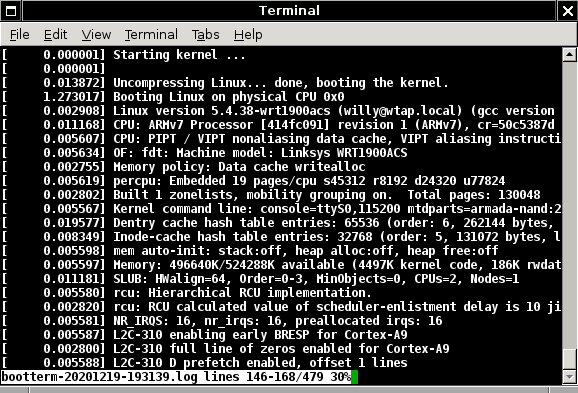

# BootTerm

Bootterm is a simple, reliable and powerful terminal designed to ease connection to ephemeral serial ports as found on various SBCs, and typically USB-based ones.

## Main Features

- automatic port detection (uses the most recently registered one by default)
- enumeration of available ports with detected drivers and descriptions
- wait for a specific, a new, or any port to appear (convenient with USB ports)
- support for non-standard baud rates (e.g. 74880 bauds for ESP8266)
- can send a Break sequence and toggling RTS/DTR for various reset sequences, even on startup
- fixed/timed captures to files (may be enabled at run time)
- optionally time-stamped captures (relative/absolute dates)
- reliable with proper error handling
- single binary without annoying dependencies, builds out of the box
- supports stdin/stdout to inject/download data
- configurable escape character and visible character ranges

## Setup

Setting it up and installing it are fairly trivial. By default it will install in `/usr/local/bin` though this can be changed with the `PREFIX` variable, e.g. to install in ~/.local/bin instead:

```
$ git clone https://github.com/wtarreau/bootterm
$ cd bootterm
$ make install PREFIX=~/.local
$ (or "sudo make install" for a system-wide installation)
```

The program comes with no other dependency than a basic libc and produces a single binary (`bt`). It can easily be cross-compiled by setting `CROSS_COMPILE` or `CC`, though the makefile only adds unneeded abstraction and could simply be bypassed (please check it, it's self-explanatory). It was tested on several Linux distros and platforms (i386, x86_64, arm, aarch64), on macOS, on FreeBSD 12 (arm64) and on AIX 5.1 (ppc).

## Using it

### Most common usage
By default, `bt` connects to the last registered serial port, which usually is the most recently connected USB adapter. A list of currently available ports is obtained by `bt -l`:

```
$ bt -l  
 port |  age (sec) | device     | driver           | description
------+------------+------------+------------------+----------------------
    0 |     524847 | ttyAMA0    | uart-pl011       |                  
    1 |     524847 | ttyUSB0    | ftdi_sio         | TTL232R-3V3      
    2 |       1320 | ttyUSB1    | ch341-uart       |                  
 *  3 |        206 | ttyUSB2    | cp210x           | CP2102 USB to UART Bridge Controller 
```

In the example above, `ttyUSB2` will be used when no option is specified (which is indicated by the star in front of the port number). Otherwise, running `bt ttyUSB2`, `bt /dev/ttyS0`, or anything else will also do what is expected. The help is shown with `bt -h`.

Once connected, the default escape character is the same as telnet: Ctrl-] (Control and right-square-bracket). After the escape character, a single character is expected to issue an internal command. Quitting is achieved by pressing `q` (either upper or lower case) or `.` (dot) after the escape character. Sending the escape character itself is possible by issuing it again. If the command that must follow the escape character doesn't arrive within two seconds, the escape character is ignored, and the terminal will emit a visible flash when supported, to indicate the user that the escape sequence was aborted. A help page is available with `h` or `?`:

```
$ bt
No port specified, using ttyUSB0 (last registered). Use -l to list ports.
Trying port ttyUSB0... Connected to ttyUSB0 at 115200 bps.
Escape character is 'Ctrl-]'. Use escape followed by '?' for help.

BootTerm supports several single-character commands after the escape character:
  H h ?      display this help
  Q q .      quit
  P p        show port status
  D d        flip DTR pin
  R r        flip RTS pin
  F f        flip both DTR and RTS pins
  B b        send break
  C c        enable / disable capture
  T t        enable / disable timestamps on terminal
Enter the escape character again after this menu to use these commands.
```

### Waiting for a new serial port

Most often you don't want to know what name your serial port will have, you just want to connect to the one you're about to plug, as soon as it's available, in order to grasp most of the boot sequence. That's what `bt -n` is made for. It will check the list of current ports and will wait for a new one to be inserted. It even works if one port is unplugged and replugged. This is very convenient to avoid having to follow cables on a desk, or when connecting to a device that gets both the power and the console from the same USB connector. It's worth noting that this wait feature is ignored when `-l` is used to get an instant list of detected ports.

The automatic port detection is more precise on Linux and FreeBSD where a detailed list of available ports with their respective drivers and descriptions are available. On other operating systems, the automatic detection falls back to a scan of node in `/dev`, avoiding known unrelated ones, and focusing on specific ones for certain operating systems (e.g. macOS uses `cu.*`).

Example below booting a Breadbee board with an integrated CH340E adapter after `bt -n`:

```
$ bt -n
3 ports found, waiting for a new one...
 port |  age (sec) | device     | driver           | description
------+------------+------------+------------------+----------------------
    3 |          0 | ttyUSB1    | ch341-uart       |                  

Trying port ttyUSB1... Connected to ttyUSB1 at 115200 bps.
Escape character is 'Ctrl-]'. Use escape followed by '?' for help.
!

U-Boot 2019.07-00068-g18b9e73630-dirty (May 30 2020 - 13:37:48 +0900)

DRAM:  64 MiB
```

One particularly appreciable case is when connecting to an emulated port, such as below on a NanoPI NEO2 running Armbian:
```
$ bt -n
2 ports found, waiting for a new one...
 port |  age (sec) | device     | driver           | description
------+------------+------------+------------------+----------------------
    2 |          0 | ttyACM0    | cdc_acm          | CDC Abstract Control Model (ACM) 
```

This port selection mode can be automatically enabled by setting the `BT_SCAN_WAIT_NEW` environment variable to any value:

```
$ export BT_SCAN_WAIT_NEW=1
$ bt
3 ports found, waiting for a new one...
```

### Waiting for any port

A different approach consists in waiting for either a specific port or any port. By default, issuing `bt ttyUSB0` will fail if this terminal doesn't exist yet. But with `bt -a ttyUSB0`, BootTerm will wait for the device to appear. Just like with `-n`, this wait feature is ignored when `-l` is used to get an instant list of detected ports.

With no device name specified, it will wait for any usable device and use the most recent one. If some ports are already on board and must never be used, they can be excluded using the environment variable `BT_SCAN_EXCLUDE_PORTS`, which is a comma-delimited list of device names, possibly ending with `*`:

```
$ export BT_SCAN_EXCLUDE_PORTS=ttyS0,ttyS1
$ bt -a
Waiting for one port to appear...
Port ttyUSB0 available, using it.
 port |  age (sec) | device     | driver           | description
------+------------+------------+------------------+----------------------
    0 |          0 | ttyUSB0    | ch341-uart       |                  

Trying port ttyUSB0... Connected to ttyUSB0 at 115200 bps.
Escape character is 'Ctrl-]'. Use escape followed by '?' for help.
```

It is also possible to enable this port selection mode by default using `BT_SCAN_WAIT_ANY`:
```
$ export BT_SCAN_EXCLUDE_PORTS=ttyS*
$ export BT_SCAN_WAIT_ANY=1
$ bt
Waiting for one port to appear...
```

It is probably what most laptop users will want to do so as never to have to pass any argument and automatically connect to a USB serial port.

One may also exclude some drivers from the scan using `BT_SCAN_EXCLUDE_DRIVERS`, which can sometimes be more convenient to ignore some known uninteresting internal devices:
```
$ bt -l
 port |  age (sec) | device     | driver           | description
------+------------+------------+------------------+----------------------
    0 |      12562 | ttyACM0    | cdc_acm          | Fibocom L830-EB
    1 |         99 | ttyS0      | serial           |
 *  2 |         21 | ttyUSB0    | cp210x           | CP2102 USB to UART Bridge Controller

$ BT_SCAN_EXCLUDE_DRIVERS=serial,cdc_acm bt -l
 port |  age (sec) | device     | driver           | description
------+------------+------------+------------------+----------------------
 *  0 |         24 | ttyUSB0    | cp210x           | CP2102 USB to UART Bridge Controller
```

Alternately, it is possible to restrict the port enumeration to only a specific set by listing them in `BT_SCAN_RESTRICT_PORTS`. This can be more convenient when you know that your port is always called `ttyACM0` or any such thing for example. Similarly these ports can end with `*` to validate any suffix, such as `ttyACM*`.

### Changing the baud rate

On opening, the port's baud rate is automatically changed to the value specified with `-b`, or in the `BT_PORT_BAUD_RATE` variable, or by default to 115200 if neither is set. However if the baud rate is explicitly set to 0 (either using `-b` or using the variable) then the baud rate is unchanged. Example below with a NodeMCU module:

```
$ bt -b 74880
Port ttyUSB2 available, using it.
 port |  age (sec) | device     | driver           | description
------+------------+------------+------------------+----------------------
    2 |     524342 | ttyUSB2    | cp210x           | CP2102 USB to UART Bridge Controller 

Trying port ttyUSB2... Connected to ttyUSB2 at 76800 bps.
Escape character is 'Ctrl-]'. Use escape followed by '?' for help.
```

It is interesting to note above that the hardware does not support 74880 bauds and selected its closest support speed (76800). This is a 2.5% error, it will not cause any trouble.

### Using bootterm to detect ports

Bootterm supports a "print" mode. In this mode it will simply print the device name without the leading `/dev/`. It can be convenient as an assistant to other flashing tools to wait for a port and print its name. By default the newly detected port is reported however, and it is wise to switch to quiet mode to avoid intermediary information:
```
$ bt -np
4 ports found, waiting for a new one...
ttyUSB2
```

```
$ bt -npq
ttyUSB2

```

Thus a script that needs to connect to the port as early as possible to reprogram a board could be doing something like this to wait for the device to show up:
```
PORT=$(bt -npq)
if [ -n "$PORT" ]; then
   flash -p "$PORT" -i "$IMAGE"
fi
```

### Issuing special sequences

The current port status (name, speed, pins) is reported when pressing `p` after the escape sequence. Pin names in lower cases are in the low state, those in upper case are in the high state. When pin toggling is required, it is wise to check the real pin's polarity, as most circuits invert it multiple times along the chain. The reported status here is the one seen by the serial port driver.

A break sequence can be used to trigger the SysRq feature in Linux, or to reboot some boards. The break happens by pressing `b` after the escape key. E.g. `Ctrl-] b`. It is also possible to send a break sequence just before starting the terminal by passing `-B` on the command line. Combined with `-N`, it may be used to simply program a reset from a script (e.g. `bt -aqNB`).

The DTR pin can be toggled by pressing `D` after the escape character, and the RTS pin can be toggled by pressing `R`. Both pins can be toggled together (for example to reset an ESP8266 in flashing mode) by pressing `F`.

### Capturing responses

There are two ways of capturing responses. If no terminal is needed, simply redirecting `bt`'s output to a file will work:

```
$ bt /dev/ttyS0 > server-panic.log
```

If a terminal is needed and a capture of the session is desired, there is a special capture function. It supports three modes, which are enabled either by `-c` on the command line, otherwise by environment variable `BT_CAPTURE_MODE`:

 - `none` : capture is disabled, this is the default
 - `fixed`: a file name is fixed on start of the capture and will not change
 - `timed`: the file name is re-evaluated each second and if it changes, the previous file is closed and a new one is opened.

In all cases, the files are only appended to and never truncated, so that bootterm will never destroy previous traces. If a fresh file is needed, just remove the file before starting bootterm.

The `fixed` mode usually is the one that users will want to capture a session when dumping a boot loader's configuration or the kernel's boot messages. The `timed` mode can be useful when connecting to a port waiting for rare or periodic events in order to get a dated file. The file name is defined by the format passed to `-f`, which defaults to the current date and time. It uses `strftime()` so please check this man page to get all format options supported on your system.

Thus when exploring a new device, one would likely use:
```
$ bt -c fixed
```

And when collecting event logs from a server with one file per day:
```
$ bt -c timed -f "server-%Y%m%d.log"
```

### Timestamps in captures

Timestamps may be enabled in captures, according to the `-t` command line argument, or the `BT_TIMESTAMP_MODE`, which may contain one of the following values:

  - `none`: no timestamp is added, lines are dumped exactly as received, this is the default
  - `abs` : the date and time of the first character at the beginning of a line are dumped using year,month,day,hour,minute,second,micro enclosed in square brackets at the beginning of the line, followed by a space, such as `[20201219-192208.888633]`.
  - `init`: the time of the first character of each line, relative to the start of the program is printed at the beginning of each line using seconds and microseconds inside square brackets followed by a space, such as `[     3.557564]`. The seconds are padded on 6 characters, which are enough for 11 days of capture. Above this the field's width will increase.
  - `line`: the time of the first character of each line, relative to the date of the previous line is printed at the beginning of each line using seconds and microseconds inside square brackets followed by a space, such as `[     1.273017]`. The seconds are padded on 6 characters, which are enough for 11 days of pause between two lines. Above this the field's width will increase.

Example of capture with line-relative timestamps, showing a kernel decompression time of 1.27 second:


In addition, timestamps may also be temporarily enabled on the terminal by pressing 'T' after the escape character. The timestamp mode configured above will be used, except if not set, in which  case the absolute mode will be used. It is important to understand that timestamps on a terminal will quickly cause trouble on the output since the terminal and the application are seeing different contents and positions. It can be convenient to observe boot times for example, but should be disabled when starting any interactive application (e.g. an editor).

Please note that there is a subtle difference between terminal timestamp and file-based captures. In file-based captures, the time is taken when the first character is printed after a line feed. This provides the most accurate timing between two consecutive lines because it will take the processing time into account. However on the terminal it cannot be done exactly this way without rendering the terminal very painful to use, because on a typical prompt, the leading timestamp would be missing until the user presses a character that would suddenly cause the timestamp to be printed before it is echoed. Thus on the terminal, the timestamp is calculated when the cursor goes to the beginning of a new line, and is (re-)printed every time the cursor goes to the beginning of the line. This means that on the terminal, the processing time, if any, will usually be accounted as part of the time needed to print the next line.

### Changing the escape character

The escape character may be specified either as a single character after -e or as an integer or hexadecimal value representing the ASCII code of this character.

Users coming from the venerable `screen` utility will probably want to set the escape character to Ctrl-A (unless of course they want to call screen from within these sessions, or are irritated by the confiscation of this common sequence):

```
$ bt -e1
```

Those coming from tmux would rather use Ctrl-B:
```
$ bt -e2
```

Here are a few other convenient and less common escape characters:

|Sequence | Code | Argument |
|---------|------|----------|
| Ctrl-@  |  0   | `-e0`    |
| Ctrl-A  |  1   | `-e1`    |
| Ctrl-Z  |  26  | `-e26`   |
| Esc     |  27  | `-e27`   |
| Ctrl-\  |  28  | `-e28`   |
| Ctrl-]  |  29  | `-e29`   |
| Ctrl-^  |  30  | `-e30`   |
| Ctrl-_  |  31  | `-e31`   |


### Masking problematic characters

Running at wrong speeds or connecting during a boot sequence often results in some garbage to be received on a terminal. And different terminal emulators handle these differently. For example, Xterm supports a very large variety of codes in the C1 range (0x80-0x9F) among which CSI (0x9B) which is an escape with the high bit set. The problem is that the prefix range is large and that many of them will result in reconfiguring it or hanging it until a sequence ends. This is often translated into unreadble fonts, the terminal definitely freezing, or arrow keys making the cursor move on the screen instead of being sent to the remote terminal. Other terminals have their own problems with 0x00, 0xFF or can be at risk with improper handling of ANSI codes prefixed with 0x1B.

In order to address this, bootterm can block dangerous characters and print them encoded instead. It will always block raw and UTF-8 encoded C1 codes (0x80-0x9F with or without the 0xC2 prefix), as these are always terminal configuration codes which should never be sent to the terminal emulator. In addition it's possible to restrict the range of printable characters using `-m` and `-M`.

### Remapping CR to CRLF or LF to CRLF

In raw mode, terminals emit CR and LF separately and expect them both to be received. This is true as well for the user terminal. If the device being connected to works in raw mode but does not emit CR or does not emit LF, then the user terminal will quickly be confusing and painful to use. An environment variable, `BT_PORT_CRLF` may be used to force a remapping of input characters to the expected CRLF pair:

| BT_PORT_CRLF | Behavior | Use case |
|--------------|----------|----------|
|      0       | no remapping | all the time |
|      1       | LF is replaced by CRLF | when lines look like stairs |
|      2       | CR is replaced by CRLF | when the same line always gets overwritten |

Note that in order to make this compatible with captures and terminal timestamps, the remapping is performed inside the port buffer before the captures, and as such the fixed CRLF sequence will appear in the captures.

Most users will never need to change this setting.

## Motivation

The first motivation behind writing bootterm was that when working with single board computers (SBC), the serial port is the only interface available during most of the development or exploration of the board, and that sadly, the available tools are either pretty poorly designed, or incomplete as they were not initially made for this purpose. Some tools like `screen` use particularly inconvenient key mappings making it a real pain to use the line editing on some devices, others like `minicom` reconfigure the terminal disabling scrolling and making copy-paste a nightmare. Some like `cu` were not initially designed for this and nobody ever knows the right command-line options nor how to quit it. Then comes the myriad of Python 3-liners which do no error checking, resulting in spinning loops when a port is disconnected and the port being renumbered once reconnected, or conversely crashes and backtraces when facing binary character sequences that do not match UTF-8. Not to mention that many times they can't even install as they depend on various modules that are incompatible with those installed on the local machine.

The author has had the best experience with `kwboot`, a tool initially made for flashing some Marvell-based devices, which integrates a terminal that is started at the end of the transfer, and which is now part of U-Boot. A few fixes and changes were brought there (such as allowing the terminal to start without flashing), and it served the purpose reasonably well for a few years. But it doesn't support non-standard speeds that some chips require (ESP8266 at 74880 bps, Rockchip SoCs at 1.5 Mbps) and is not easy to build out of U-boot. After losing too much time fighting with such tools and cycling between them, the author considered that it was about time to address the root cause of the problem, which is that none of these tools was initially written for being used as they are used nowadays, and that if they fit the purpose so badly, it's because they're simply abused.

## Miscellaneous

This program was written by Willy Tarreau <w@1wt.eu> and is licensed under MIT license. Fixes and contributions are welcome.
